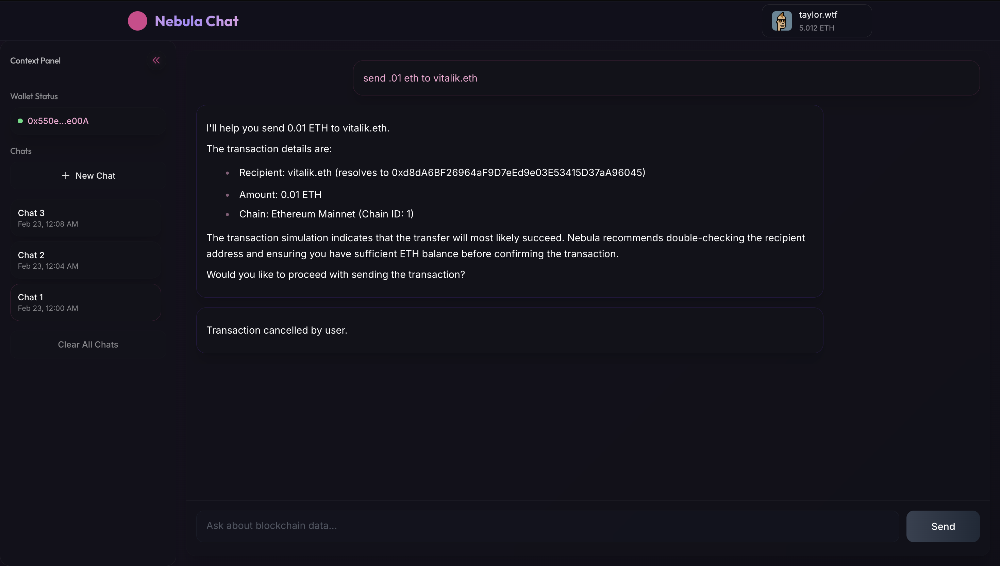
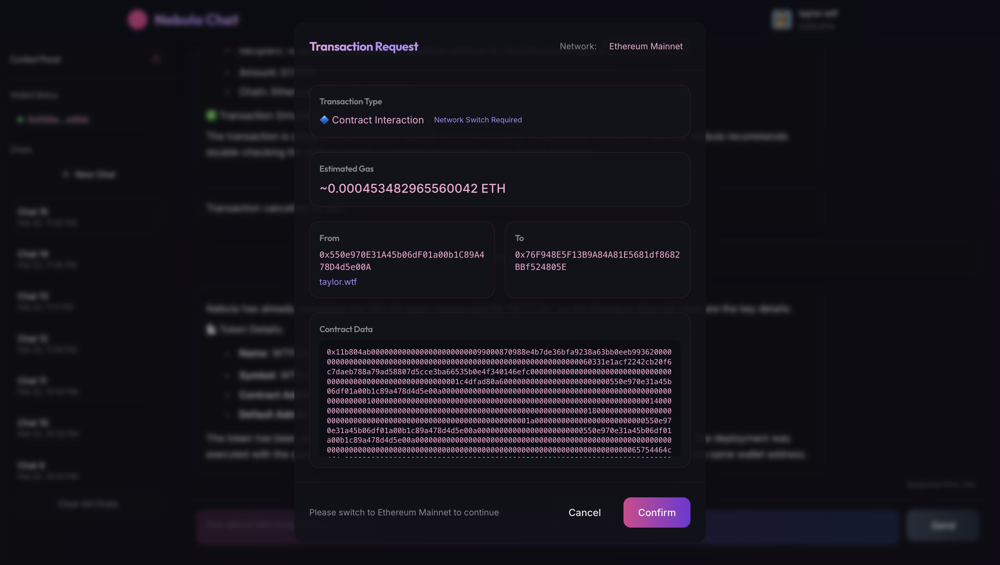
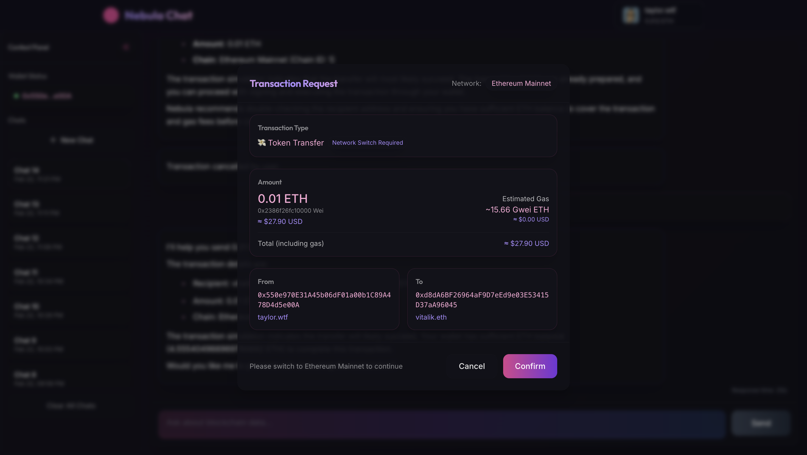

# Nebula Chat

By [TAYLOR.WTF](https://taylor.wtf)

A modern, real-time chat interface for interacting with blockchain data using ThirdWeb's Nebula API. Built with Next.js 14, TypeScript, and Tailwind CSS.



## Demo

Experience real-time blockchain interactions with a beautiful, responsive interface:




## Features

- 🌐 Real-time blockchain data interaction
- 💬 Streaming chat responses with markdown support
- 🎨 Responsive UI with dark mode
- 🔒 Secure wallet connection via ThirdWeb
- ⚡ Real-time response streaming
- 📝 Multi-line message input support
- ⏱️ Response time tracking
- 🎯 Support for blockchain transactions and actions
- 📱 Collapsible sidebar for better mobile experience
- 💼 Enhanced transaction handling:
  - Contract deployment support
  - Smart contract interaction
  - Token transfers with USD value estimation
  - Gas fee estimation in ETH and USD
  - ENS name resolution
  - Network switching support
- 💾 Persistent chat history with localStorage
- 🔄 Real-time price updates for transactions
- 📊 Transaction status tracking

## Tech Stack

- **Framework**: Next.js 14 (App Router)
- **Language**: TypeScript
- **Styling**: Tailwind CSS
- **Web3**: ThirdWeb SDK
- **Markdown**: React-Markdown with GFM support
- **State Management**: Zustand
- **Animations**: Framer Motion
- **API Integration**: Server-Sent Events (SSE)

## Getting Started

### Prerequisites

- Node.js 18+ 
- npm/yarn
- A ThirdWeb account and API key

### Installation

1. Clone the repository:
```bash
git clone https://github.com/taylorwtf/nebula.git
cd nebula
```

2. Install dependencies:
```bash
npm install
```

3. Create a `.env.local` file in the root directory:
```env
NEBULA_API_KEY=your_nebula_api_key
NEXT_PUBLIC_NEBULA_CLIENT_ID=your_nebula_client_id (thirdweb client id)
```

4. Run the development server:
```bash
npm run dev
```

5. Open [http://localhost:3000](http://localhost:3000) in your browser.

## Environment Variables

Required environment variables:
- `NEBULA_API_KEY`: Your ThirdWeb Nebula API key for chat functionality
- `NEXT_PUBLIC_NEBULA_CLIENT_ID`: Your ThirdWeb Nebula Client ID

You can obtain these from the [ThirdWeb Dashboard](https://thirdweb.com/dashboard/settings/api-keys)

## Project Structure

```
src/
├── app/                # Next.js app router files
├── components/         # React components
│   ├── chat/          # Chat-related components
│   ├── navbar/        # Navigation components
│   └── sidebar/       # Sidebar components
├── lib/               # Utility functions and API clients
│   └── store/         # Zustand store configurations
└── types/             # TypeScript type definitions
```

## Key Components

- `ChatContainer`: Main chat interface container
- `MessageList`: Handles message display and thinking indicators
- `MessageInput`: Multi-line input with Shift+Enter support
- `MessageBubble`: Renders messages with markdown support
- `TransactionHandler`: Manages blockchain transactions
- `Sidebar`: Collapsible chat history management
- `WalletButton`: ThirdWeb wallet connection

## Features in Detail

### Real-time Response Streaming
- Server-Sent Events (SSE) for real-time updates
- Live typing indicators with timing
- Response time tracking
- Auto-scroll with user scroll position preservation

### Transaction Management
- Support for multiple transaction types:
  - Token transfers
  - Contract deployments
  - Contract interactions
- Real-time gas estimation
- USD value conversion for amounts and gas fees
- Network detection and switching
- ENS name resolution for addresses
- Transaction status tracking
- Beautiful transaction UI with animations

### Persistent Chat History
- Local storage for chat persistence
- Chat management (create, delete, clear all)
- Timestamp tracking for conversations
- Responsive sidebar with collapse support

### Markdown Support
- Code blocks with syntax highlighting
- Lists (ordered and unordered)
- Links with custom styling
- Headers and formatting

### Wallet Integration
- Secure wallet connection via ThirdWeb
- Support for multiple wallet providers
- Transaction signing capabilities
- Network switching support

## Contributing

1. Fork the repository
2. Create your feature branch (`git checkout -b feature/amazing-feature`)
3. Commit your changes (`git commit -m 'Add some amazing feature'`)
4. Push to the branch (`git push origin feature/amazing-feature`)
5. Open a Pull Request

## License

This project is licensed under the MIT License - see the [LICENSE](LICENSE) file for details.

## Acknowledgments

- [ThirdWeb](https://thirdweb.com/) for the Nebula API
- [Tailwind CSS](https://tailwindcss.com/) for the styling system
- [Next.js](https://nextjs.org/) for the React framework
- [Framer Motion](https://www.framer.com/motion/) for animations
- [Zustand](https://zustand-demo.pmnd.rs/) for state management

## Vercel Deployment Guide

This application is configured for easy deployment on Vercel with client-side API key handling.

### Deployment Steps

1. Fork or clone this repository to your GitHub account
2. Sign up for [Vercel](https://vercel.com) if you haven't already
3. Create a new project in Vercel and import your GitHub repository
4. Set up environment variables in Vercel's project settings:
   - `NEXT_PUBLIC_USE_CLIENT_KEYS=true` (Required)
   - `NEBULA_API_KEY` (Optional fallback)
   - `NEXT_PUBLIC_NEBULA_CLIENT_ID` (Optional fallback)
5. Deploy the project

### Client-Side API Key Handling

This application is set up to handle Nebula API keys entirely on the client side for improved security:

- 🔒 **In-Memory Only**: API keys are stored in memory only and never persisted
- 🔄 **User-Provided**: Users enter their own API keys when using the application
- ⚠️ **Session-Based**: Keys are cleared when the page is refreshed or closed
- 🛡️ **Direct API Calls**: API calls are made directly from the client to the Nebula API

### Getting API Keys

Users will need to obtain their own API keys from ThirdWeb Nebula:

1. Visit [ThirdWeb Nebula](https://thirdweb.com/nebula)
2. Sign up or log in to your account
3. Create a new API key in your dashboard
4. Copy the API key and client ID
5. Enter these in the app's API key setup page

### Security Considerations

- Users should understand that their API keys are stored in memory only
- The application implements warnings before page closure
- The API key input form uses password fields by default
- A status indicator shows when keys are active in memory
- Keys are never stored in cookies, localStorage, or any persistent storage
